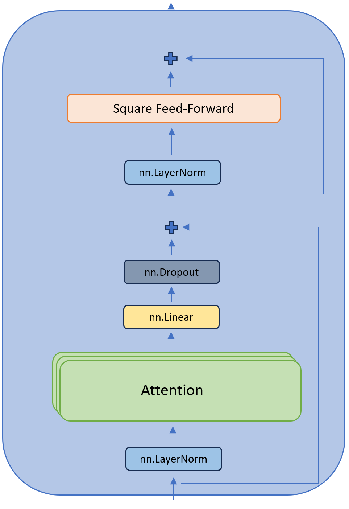

# GPT from Scratch
This repository contains a GPT-like model based on the [Let's build GPT: from scratch, in code, spelled out](https://www.youtube.com/watch?v=kCc8FmEb1nY) tutorial video.


# Environment Configuration
Ensure the [tatooine](https://github.com/atkinssamuel/tatooine) repository exists a directory above this one. 

```
├── gpt-from-scratch/
│   └── ...
└── tatooine/
    └── ...
```

Then, create a Python environment and install the dependencies in the `requirements.txt` file:

```bash
python -m venv .venv
source .venv/bin/activate
pip install -r requirements.txt
```

# Model Explanation
The model is a decoder-only model. It replicates many of the components in the [Attention Is All You Need](https://1drv.ms/b/s!Aq54YqVxo3iF5THdwn7HwvjWkFrY?e=Pggt31) paper. The image below illustrates the model architecture:


The input data is tokenized using a character-by-character tokenizer. Then, the tokenized input data is fed into an embedding layer which creates a token embedding. This token embedding is combined with the positional embedding (which encodes the indices of the tokens in a batch into an embedding space). This is then fed into N sequential multi-head attention + feedforward blocks. The output is then passed into a layer normalization layer and a final linear layer to generate a token prediction. 

The figure below illustrates the structure of a single multi-head attention + feedfoward block:



As shown in the figure above, the input is pre-layer layer normalized and then fed into multiple stacked attention components. The output of each of these attention components is concatenated. Then, it is passed through a linear layer and a dropout layer. The resulting output is then combined with the original input through a residual connection. A similar process occurs in which the input is pre-layer normalized, passed through a square feed-forward component, and then combined again with the input through a residual connection. 

Breaking down the model further, the image below illustrates the structure of an individual attention block.


In an attention block, the input is split three ways and passed into three linear layers. The outputs of these three linear layers are the key, query, and value vectors (K, Q, and V). These vectors are passed into the scaled dot-product attention formula and dropout is applied to the weight matrix, $QK^T$. As mentioned before, there are multiple attention "heads". The outputs of these heads are concatenated and fed into the next phase of the model.

The image below details the square feed-forward block.


The input is passed through a linear layer, the ReLU activation function, another linear layer, and then a dropout layer. 

# Model Parameters

- `n_updates`: the number of training updates computed during the training loop
- `batch_size`: the number of X and y data pairs to include in a batch during each training update iteration
- `n_embd`: the size of the embedding space used to embed the tokens and positions
- `n_heads`: the number of attention heads to use inside each multi-head + feedforward block
- `n_layers`: the number of multi-head attention + feedforward blocks to use
- `learning_rate`: the learning rate used to update the model parameters